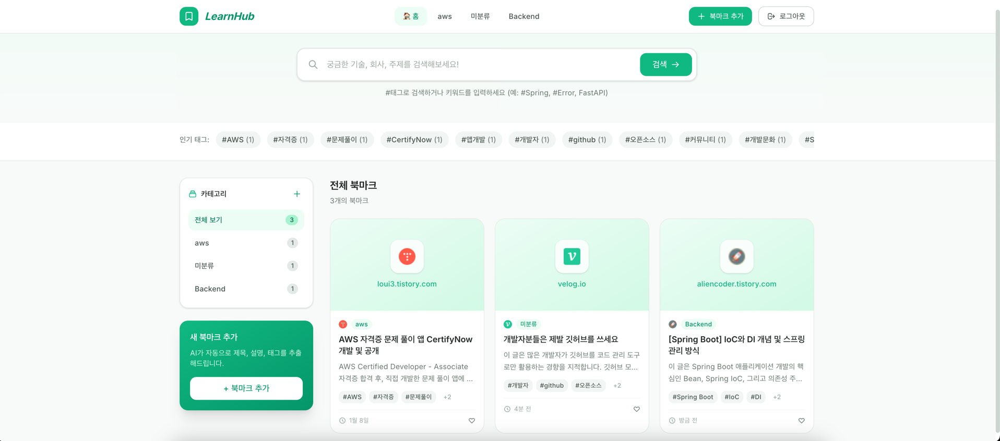

# LearnHub - AI 기반 개발 자료 북마크 플랫폼

> 개발자의 학습 패턴을 이해하는 스마트 북마크 관리 시스템

[](https://spring.io/projects/spring-boot)
[](https://reactjs.org/)
[](https://www.mysql.com/)

---

## 📖 Overview

### 해결하고자 한 문제
개발자는 학습 과정에서 수십 개의 공식 문서, 기술 블로그, 레퍼런스를 참고합니다. 하지만 브라우저 기본 북마크는 **태그 분류**, **통합 검색**, **자동 분류** 기능이 부족해 자료를 다시 찾기 어렵습니다.

### 핵심 가치
- **AI 자동 분석**: URL 입력만으로 제목, 설명, 태그, 카테고리 자동 추출 (Google Gemini)
- **개발자 전용 구조**: 기술 스택별 카테고리, 다중 태그 지원
- **빠른 검색**: 제목/설명/URL/태그 통합 검색 (SQL Injection 방어)




---

## ✨ 주요 기능

### 1. 북마크 관리 (CRUD)
- URL 기반 학습 자료 저장 (제목, 설명, 썸네일)
- 카테고리별 분류 (Spring, React, Database 등)
- 다중 태그 지원 (1:N 관계)

### 2. AI 자동 분석 (Google Gemini 2.5 Flash)
- URL 입력 시 제목/설명 자동 추출
- 적합한 태그 추천
- 카테고리 자동 분류

### 3. 통합 검색
- 키워드 기반 검색 (제목/설명)
- 카테고리/태그 필터링
- SQL Injection 방어

### 4. 인증/인가
- JWT 기반 인증
- Spring Security 권한 관리
- 사용자별 데이터 격리

---

## 🛠 기술 스택

### Backend
| 기술 | 버전 | 용도 |
|------|------|------|
| **Spring Boot** | 4.0.0 | 백엔드 프레임워크 |
| **Java** | 17 | 프로그래밍 언어 |
| **Spring Data JPA** | - | ORM, N+1 최적화 |
| **Spring Security** | - | JWT 인증/인가 |
| **MySQL** | 8.0 | 관계형 데이터베이스 |
| **Gradle** | 9.2.1 | 빌드 자동화 |
| **JUnit 5 + H2** | - | 단위 테스트 |
| **Jsoup** | 1.17.2 | HTML 파싱 |
| **Swagger** | 3.0 | API 문서화 |

### Frontend
| 기술 | 버전 | 용도 |
|------|------|------|
| **React** | 19.2.0 | UI 라이브러리 |
| **React Router** | 7.9.6 | SPA 라우팅 |
| **Tailwind CSS** | 3.4.1 | 유틸리티 CSS |
| **Axios** | 1.13.2 | HTTP 클라이언트 |

### External API
- **Google Gemini API** (2.5 Flash): AI 기반 URL 분석

---

## 🏗 아키텍처

### System Architecture
```
Frontend (React)
    ↓ HTTP + JWT
Backend (Spring Boot)
    ↓ JPA
MySQL
    ↑
Google Gemini API (AI)
```

### Database ERD
```
User (1) ──────────────────────── (n) Category
  │ (1)                              │ (n)
  │                                  └─ Bookmarks
  │                                      │ (n)
  └──────────── (n) Bookmark ────────────┼──────────── (n) Tag
                                          │
                                          └─── (n) BookmarkTag (junction)
```

### Layered Architecture
```
Controller (REST API)
    ↓
Service (비즈니스 로직)
    ↓
Repository (JPA)
    ↓
MySQL Database
```

---

## 🔑 주요 API 엔드포인트

### 인증
```http
POST /api/auth/register   # 회원가입
POST /api/auth/login      # 로그인 (JWT 발급)
```

### 북마크
```http
GET    /api/bookmarks                 # 전체 조회
POST   /api/bookmarks                 # 생성
GET    /api/bookmarks/{id}            # 단일 조회
PUT    /api/bookmarks/{id}            # 수정
DELETE /api/bookmarks/{id}            # 삭제
GET    /api/bookmarks/search?keyword= # 검색
POST   /api/bookmarks/analyze         # AI 분석 (public)
```

### 카테고리
```http
GET    /api/categories     # 전체 조회
POST   /api/categories     # 생성
PUT    /api/categories/{id}  # 수정
DELETE /api/categories/{id}  # 삭제
```

### 태그
```http
GET    /api/tags           # 전체 조회
POST   /api/tags?name=     # 생성
GET    /api/tags/{id}      # 단일 조회
```

**Swagger UI**: http://localhost:8080/swagger-ui.html

---

## 🚀 빠른 시작

### 사전 요구사항
- Java 17 이상
- Node.js 20 이상
- MySQL 8.0 이상

### 1. Backend 실행

```bash
# 1. 리포지토리 클론
git clone https://github.com/YOUR_USERNAME/LearnHub.git
cd LearnHub/LearnHub_backend/learnhub-project

# 2. 환경 변수 설정
export SPRING_DATASOURCE_PASSWORD=your_mysql_password
export GEMINI_API_KEY=your_gemini_api_key

# 3. MySQL 데이터베이스 생성
mysql -u root -p
CREATE DATABASE learnhub;

# 4. 애플리케이션 실행
./gradlew bootRun
```

서버: `http://localhost:8080`

### 2. Frontend 실행

```bash
cd LearnHub_frontend
npm install
npm start
```

애플리케이션: `http://localhost:3000`

---

## 🧪 테스트

### Backend 테스트

```bash
cd LearnHub_backend/learnhub-project

# 전체 테스트 실행
./gradlew test

# 테스트 커버리지 리포트 생성 (JaCoCo)
./gradlew test jacocoTestReport
open build/reports/jacoco/test/html/index.html
```

---

## 📈 향후 개선 방향

### 테스트 코드 확장
- CategoryServiceTest, TagServiceTest 작성
- Controller 통합 테스트 (MockMvc)
- 테스트 커버리지 70% 달성

### 검색 기능 고도화
- MySQL Full-text Index 적용
- 통합 검색 (제목 + 설명 + URL + 태그)
- 검색 성능 최적화

### 성능 및 확장성 개선
- Redis 캐싱 적용 (자주 조회되는 북마크 목록)
- JMeter 부하 테스트 및 병목 지점 개선
- DB 인덱스 최적화

### 기능 확장
- Tag 구조 개선 (사용자별 소유권)
- 대시보드 통계 페이지 (카테고리별 북마크 수, 자주 조회한 태그 등)
- 북마크 공유 기능 (Public/Private 설정)

---

## 📂 프로젝트 구조

```
LearnHub/
├── LearnHub_backend/
│   └── learnhub-project/
│       ├── src/
│       │   ├── main/java/org/example/learnhubproject/
│       │   │   ├── controller/     # REST API 엔드포인트
│       │   │   ├── service/        # 비즈니스 로직
│       │   │   ├── repository/     # JPA Repository (N+1 최적화)
│       │   │   ├── entity/         # JPA 엔티티
│       │   │   ├── dto/            # DTO 객체
│       │   │   ├── security/       # JWT, Spring Security
│       │   │   ├── config/         # 설정 클래스
│       │   │   └── exception/      # 예외 처리
│       │   └── test/java/.../service/   # 서비스 계층 테스트
│       └── build.gradle
│
├── LearnHub_frontend/
│   ├── src/
│   │   ├── components/       # React 컴포넌트
│   │   ├── pages/            # 페이지 컴포넌트
│   │   └── services/         # API 호출 (Axios)
│   └── package.json
│
├── PERFORMANCE_IMPROVEMENTS.md   # 성능 개선 상세 문서
└── README.md
```

---

## 👤 Author

**Choi Jun Hyuk**
- GitHub: [Jun3671](https://github.com/Jun3671)
- Email: wnsgur33787@gmail.com
- Blog: https://velog.io/@jjun3671/posts

---

## 📚 참고 자료

- [Spring Boot Documentation](https://docs.spring.io/spring-boot/index.html)
- [JPA Performance Tuning Guide](https://docs.jboss.org/hibernate/orm/6.0/userguide/html_single/Hibernate_User_Guide.html#performance)
- [Google Gemini API](https://ai.google.dev/)
- [React Documentation](https://react.dev/)

---

**⭐ 이 프로젝트가 도움이 되었다면 Star를 눌러주세요!**
